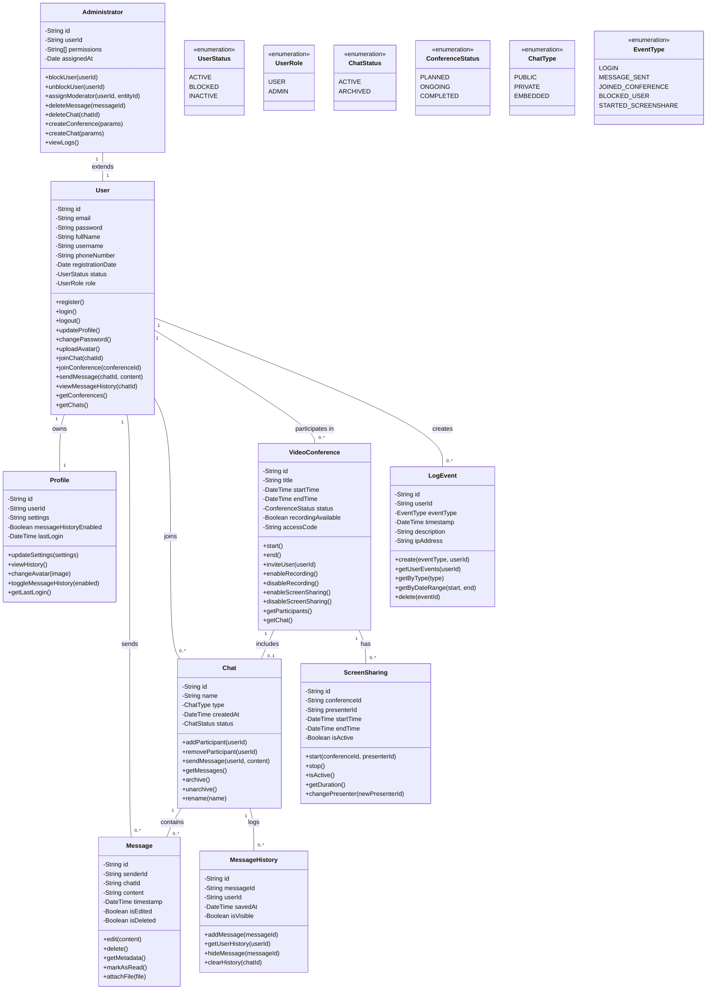

# Диаграмма классов

# Описание классов

### User (Пользователь)
Представляет зарегистрированного пользователя системы. Пользователь может участвовать в чатах и видеоконференциях, отправлять сообщения и настраивать личный профиль.

### Administrator (Администратор)
Является специализированной ролью пользователя. Обладает правами управления чатами, конференциями, пользователями и логами системы.

### VideoConference (Видеоконференция)
Класс, описывающий удалённую видеовстречу. Содержит сведения о времени проведения, участниках, доступе, наличии записи и демонстрации экрана.

### Chat (Чат)
Текстовая группа для общения пользователей. Может существовать независимо или быть встроена в видеоконференцию. Включает список сообщений и участников.

### Message (Сообщение)
Единичное текстовое или мультимедийное сообщение, отправляемое в рамках определённого чата. Содержит данные об авторе, содержимом и времени отправки.

### Profile (Личный кабинет)
Хранит настройки пользователя, включая параметры интерфейса, возможность отображения истории сообщений и дату последнего входа.

### MessageHistory (История сообщений)
Архивная запись сообщений пользователя, может использоваться для просмотра, фильтрации или восстановления сообщений.

### LogEvent (Событие)
Фиксация действий пользователя в системе. Позволяет анализировать действия в рамках сессии: вход, отправка сообщений, модерация и т.п.

### ScreenSharing (Демонстрация экрана)
Сессия отображения экрана одного из участников в рамках видеоконференции. Содержит информацию о времени, статусе и ведущем.

### UserStatus (Статус пользователя)
Перечисление возможных состояний пользователя: `ACTIVE`, `BLOCKED`, `INACTIVE`.

### UserRole (Роль пользователя)
Перечисление ролей: обычный пользователь (`USER`) и администратор (`ADMIN`).

### ChatStatus (Статус чата)
Может быть активным (`ACTIVE`) или архивированным (`ARCHIVED`).

### ConferenceStatus (Статус конференции)
Отражает состояние видеоконференции: `PLANNED`, `ONGOING`, `COMPLETED`.

### ChatType (Тип чата)
Может быть публичным (`PUBLIC`), приватным (`PRIVATE`) или встроенным в конференцию (`EMBEDDED`).

### EventType (Тип события)
Фиксируемые действия в логах: вход, отправка сообщений, участие в конференции, блокировка, запуск демонстрации экрана.
