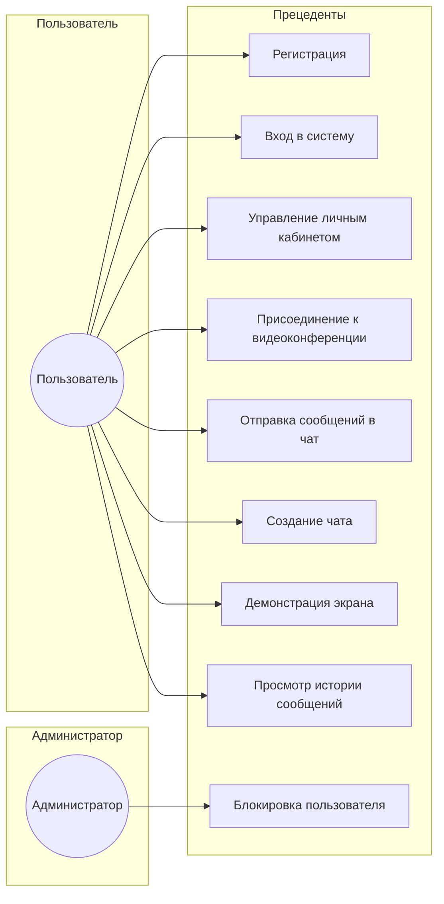

# Диаграмма прецедентов

## Описание прецедентов

### Регистрация
- **Актор**: Пользователь  
- **Предусловия**: Пользователь не зарегистрирован  
- **Основной поток**:
  1. Пользователь открывает форму регистрации  
  2. Вводит email, имя и пароль  
  3. Система проверяет корректность данных  
  4. Система создает учетную запись  
  5. Уведомление об успешной регистрации  
- **Постусловие**: Создана новая учетная запись

---

### Вход в систему
- **Актор**: Пользователь  
- **Предусловия**: Учетная запись уже создана  
- **Основной поток**:
  1. Пользователь вводит email и пароль  
  2. Система проверяет данные  
  3. Предоставляется доступ  
- **Постусловие**: Пользователь авторизован

---

### Управление личным кабинетом
- **Актор**: Пользователь  
- **Предусловия**: Пользователь авторизован  
- **Основной поток**:
  1. Открытие личного кабинета  
  2. Обновление профиля и настроек  
  3. Сохранение изменений  
- **Постусловие**: Обновлены пользовательские данные

---

### Присоединение к видеоконференции
- **Актор**: Пользователь  
- **Предусловия**: Конференция существует и доступна  
- **Основной поток**:
  1. Пользователь выбирает конференцию  
  2. Вводит код доступа (если требуется)  
  3. Система подключает к конференции  
- **Постусловие**: Пользователь участвует в конференции

---

### Отправка сообщений в чат
- **Актор**: Пользователь  
- **Предусловия**: Пользователь состоит в чате  
- **Основной поток**:
  1. Открытие чата  
  2. Ввод сообщения  
  3. Отправка и отображение в чате  
- **Постусловие**: Сообщение отправлено и сохранено

---

### Создание чата
- **Актор**: Пользователь  
- **Предусловия**: Пользователь авторизован  
- **Основной поток**:
  1. Запрос создания нового чата  
  2. Ввод названия и типа  
  3. Система создает чат  
- **Постусловие**: Новый чат доступен пользователю

---

### Демонстрация экрана
- **Актор**: Пользователь  
- **Предусловия**: Пользователь подключен к конференции  
- **Основной поток**:
  1. Запуск функции "демонстрация экрана"  
  2. Подтверждение доступа к экрану  
  3. Передача изображения другим участникам  
- **Постусловие**: Участники видят экран пользователя

---

### Просмотр истории сообщений
- **Актор**: Пользователь  
- **Предусловия**: История сообщений включена  
- **Основной поток**:
  1. Открытие раздела истории  
  2. Фильтрация и просмотр по чатам/датам  
- **Постусловие**: История отображена пользователю

---

### Блокировка пользователя
- **Актор**: Администратор  
- **Предусловия**: Пользователь нарушает правила  
- **Основной поток**:
  1. Администратор находит пользователя  
  2. Выбирает действие "блокировать"  
  3. Подтверждает операцию  
  4. Система блокирует доступ пользователя  
- **Постусловие**: Пользователь лишён доступа к системе
