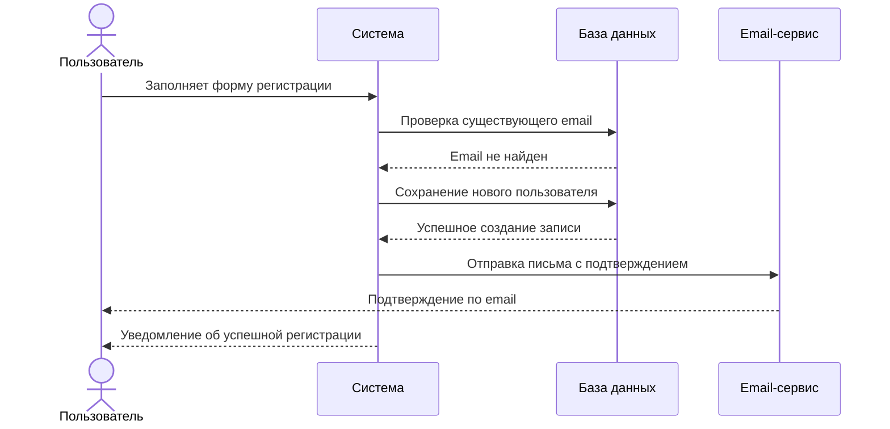
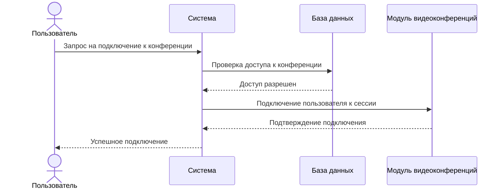
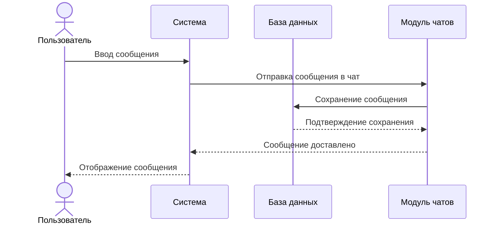
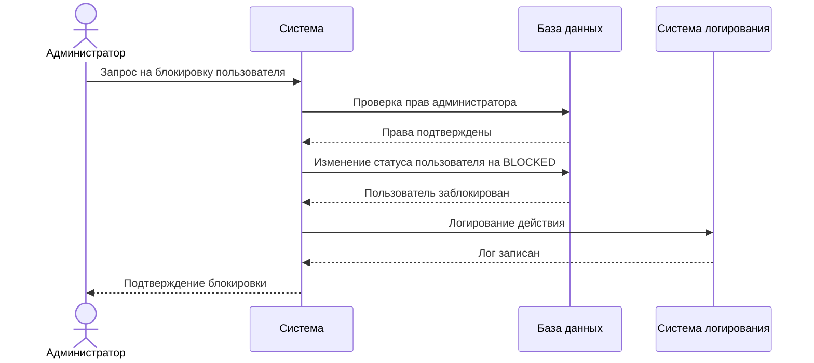

# Диаграммы последовательности

## Регистрация пользователя

## Присоединение к видеоконференции

## Отправка сообщения в чат

## Блокировка пользователя

## Описание диаграмм

### Регистрация пользователя
Диаграмма показывает процесс регистрации нового пользователя: проверка email, создание записи в базе и отправка письма-подтверждения.

### Присоединение к видеоконференции
Показывает последовательность шагов, связанных с доступом пользователя к активной видеоконференции, включая валидацию и подключение.

### Отправка сообщения в чат
Определяет, как сообщение проходит путь от ввода пользователем до отображения в чате после сохранения в БД.

### Блокировка пользователя
Описывает действия администратора при блокировке пользователя, включая проверку полномочий, изменение статуса и логирование.
