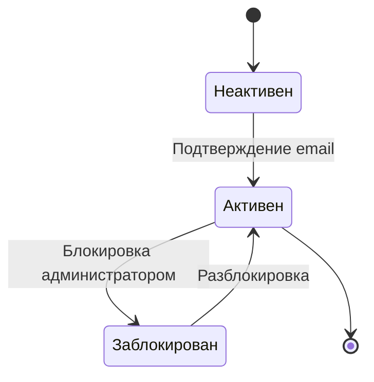
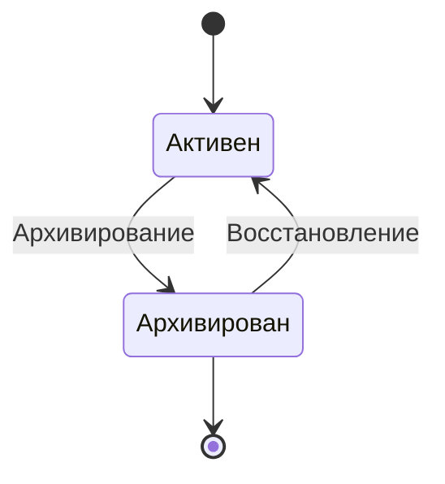
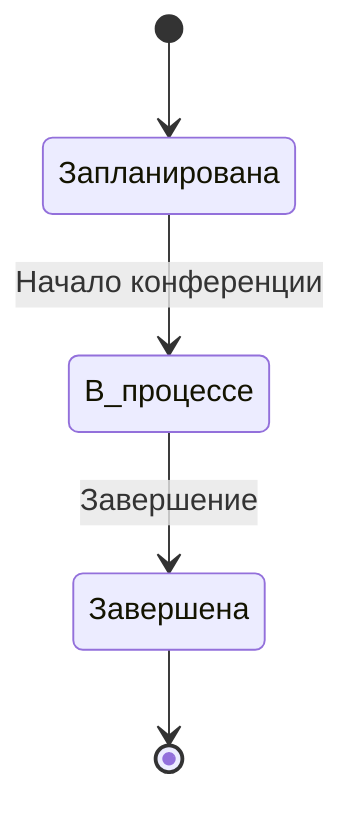
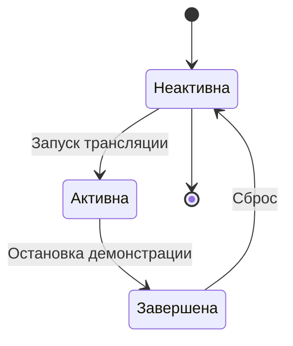

# Диаграммы состояний

## Состояние пользователя

## Состояние чата

## Состояние видеоконференции

## Состояние демонстрации экрана

# Описание диаграмм

### Состояние пользователя
Определяет жизненный цикл учетной записи:
- **Неактивен** — пользователь зарегистрировался, но не подтвердил email
- **Активен** — пользователь может использовать систему
- **Заблокирован** — доступ временно ограничен администратором

---

### Состояние чата
Отражает жизненный цикл чата:
- **Активен** — открыт для сообщений
- **Архивирован** — скрыт, но может быть восстановлен

---

### Состояние видеоконференции
Описывает этапы проведения конференции:
- **Запланирована** — ещё не началась
- **В процессе** — активна
- **Завершена** — окончена, доступ ограничен

---

### Состояние демонстрации экрана
Фиксирует процесс трансляции:
- **Неактивна** — не запущена
- **Активна** — идет трансляция
- **Завершена** — трансляция остановлена
