# Диаграмма вариантов использования

```mermaid
graph TB
    subgraph "Система видеосвязи и чатов"
        UC1[Зарегистрироваться в системе]
        UC2[Войти в систему]
        UC3[Настроить личный профиль]
        UC4[Создать чат]
        UC5[Пригласить участников в чат]
        UC6[Отправить сообщение]
        UC7[Создать видеоконференцию]
        UC8[Присоединиться к конференции]
        UC9[Демонстрировать экран]
        UC10[Заблокировать пользователя]
        UC11[Модерировать сообщения]
        UC12[Просмотреть события в логах]
        UC13[Назначить роли]
        UC14[Сохранить историю сообщений]
        UC15[Записать событие в лог]
        UC16[Завершить конференцию по расписанию]
        UC17[Очистить устаревшие сообщения]
        UC18[Проверить токен авторизации]
        UC19[Предоставить доступ к ресурсу]
        UC20[Сгенерировать ссылку на конференцию]
    end

    subgraph "Акторы"
        A1[Пользователь]
        A2[Участник чата / конференции]
        A3[Администратор]
        A4[Система]
        A5[Внешняя система аутентификации]
        A6[Время]
    end

    %% Связи Пользователя
    A1 --> UC1
    A1 --> UC2
    A1 --> UC3
    A1 --> UC4
    A1 --> UC5
    A1 --> UC7

    %% Связи Участника
    A2 --> UC6
    A2 --> UC8
    A2 --> UC9

    %% Связи Администратора
    A3 --> UC10
    A3 --> UC11
    A3 --> UC12
    A3 --> UC13

    %% Связи Системы
    A4 --> UC14
    A4 --> UC15
    A4 --> UC20

    %% Связи Внешней системы аутентификации
    A5 --> UC18
    A5 --> UC19

    %% Связи Времени
    A6 --> UC16
    A6 --> UC17
```

## Описание диаграммы

Диаграмма отражает функциональные возможности системы видеосвязи и чатов. Внутри прямоугольника — 20 вариантов использования, сгруппированных по функционалу. Акторы (внешние действующие лица) взаимодействуют с системой через соответствующие юзкейсы. Пользователь наследует базовые сценарии и может становиться участником или администратором, взаимодействуя с чатом, конференцией или правами управления.